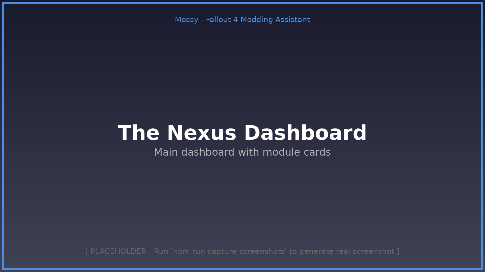
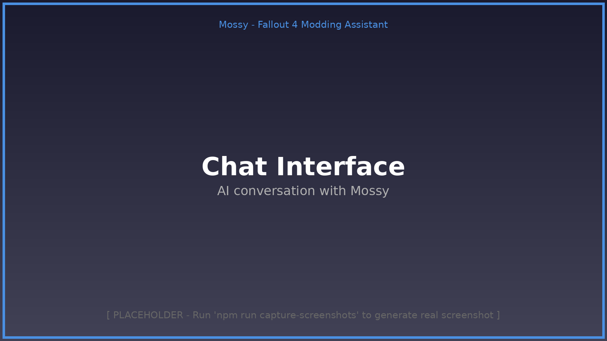
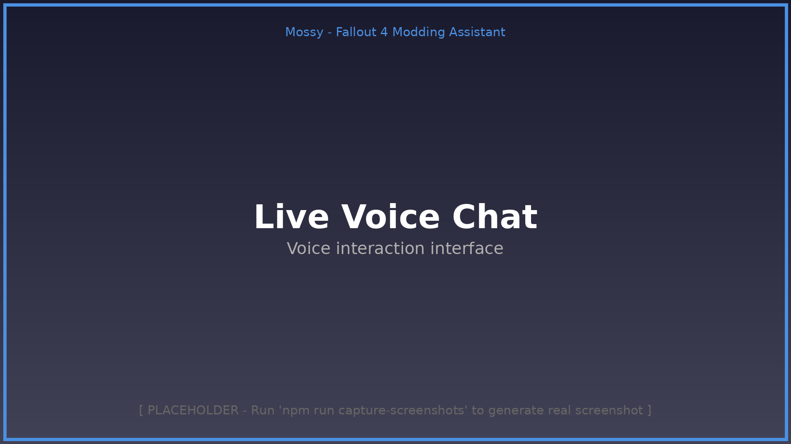
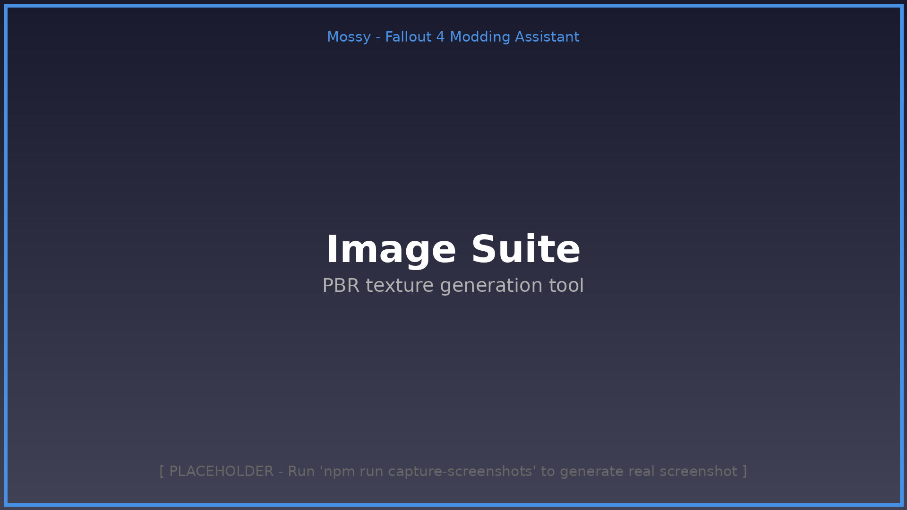
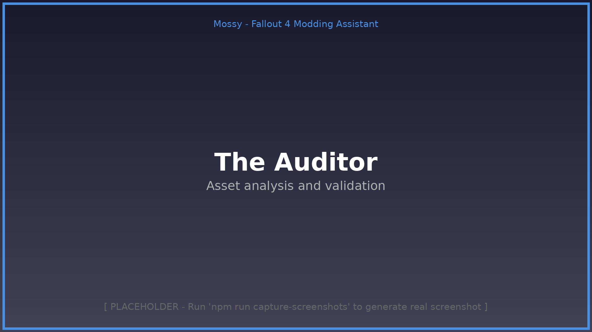
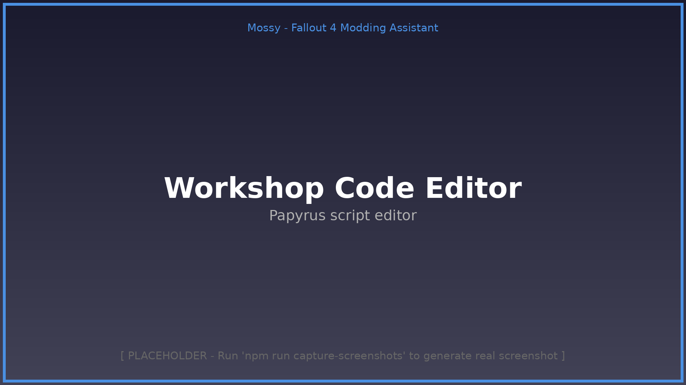
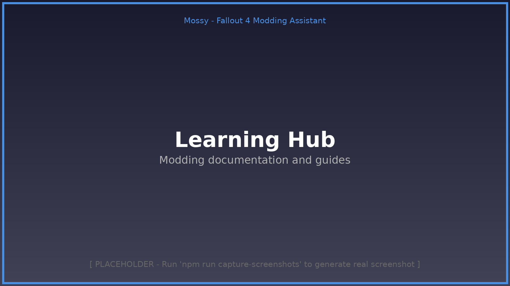

# Mossy - Comprehensive Tutorial Guide
## Your Complete Guide to Using Mossy for Fallout 4 Modding

**Version:** 5.4.21  
**Last Updated:** February 2026  
**Author:** Mossy Development Team

---

## 📚 Table of Contents

1. [Introduction](#introduction)
2. [Getting Started](#getting-started)
3. [Main Interface Overview](#main-interface-overview)
4. [Core Modules](#core-modules)
5. [Development Tools](#development-tools)
6. [Guides & Learning](#guides--learning)
7. [Advanced Features](#advanced-features)
8. [Keyboard Shortcuts](#keyboard-shortcuts)
9. [Troubleshooting](#troubleshooting)
10. [FAQ](#faq)

---

## Introduction

### What is Mossy?

Mossy is a production-ready Electron desktop application designed specifically for Fallout 4 modding. It combines AI assistance, real-time analysis, direct-write scripting, and professional asset optimization into a single, powerful toolkit.

### Key Features

- **Hybrid AI Integration** - Choose between cloud AI (OpenAI/Groq) or local Ollama for privacy
- **Memory Vault (RAG)** - Upload your own tutorials to train Mossy on your specific needs
- **Neural Link** - Real-time monitoring of your modding tools (Blender, Creation Kit, xEdit)
- **Asset Analysis** - Real binary format reading for NIF/DDS/ESP files
- **Advanced Image Processing** - Sobel operators and PBR texture generation
- **Zero Fake Features** - Everything is functional and tested

### System Requirements

- **OS:** Windows 10/11 (64-bit)
- **RAM:** 8GB minimum, 16GB recommended
- **Storage:** 2GB free space
- **Optional:** GPU for AI processing (if using local models)

---

## Getting Started

### Installation

1. **Download the Installer**
   - Get the latest `Mossy Setup 5.4.21.exe` from the releases page
   - Run the installer and follow the prompts

2. **First Launch**
   - Mossy will show a boot-up sequence (Pip-Boy themed!)
   - Complete the onboarding wizard (about 3-5 minutes)

### Onboarding Wizard

The onboarding wizard guides you through initial setup:

**Step 1: Welcome + Language Selection**
- Choose your preferred UI language
- Available: English, Español, Français, Deutsch, Русский, 中文（简体）

**Step 2: System Scan**
- Mossy scans for installed modding tools
- Detected tools: Creation Kit, xEdit, Blender, NifSkope, LOOT, etc.
- This enables deep integrations and smart suggestions

**Step 3: Tool Approvals**
- Review detected tools
- Choose which ones Mossy should integrate with
- You can change these settings later

**Step 4: Privacy Settings**
- Configure data sharing preferences
- All sharing is **OFF by default**
- Optional: Share anonymized patterns to help improve Mossy

**Step 5: Setup Complete**
- Click "Complete Setup" to launch Mossy
- You're ready to start modding!

### First Steps After Setup

1. **Explore The Nexus** - Your main dashboard showing all available modules
2. **Try Chat Interface** - Talk to Mossy about your modding project
3. **Check Settings** - Configure API keys, tool paths, and preferences
4. **Browse Learning Hub** - Access comprehensive modding documentation

---

## Main Interface Overview


*The Mossy interface showing the main dashboard, sidebar navigation, and header bar*

### Sidebar Navigation

The sidebar is your primary navigation tool in Mossy.


*The sidebar displays all module categories and navigation options*

**Location:** Left side of the screen  
**Toggle:** Click the menu icon (☰) on mobile/small screens

**Sections:**

1. **Core**
   - The Nexus (Home/Dashboard)
   - Chat Interface
   - Live Voice Chat
   - First Success Wizard

2. **Tools**
   - The Auditor (Asset Analysis)
   - Mining Panel
   - Advanced Analysis
   - The Blueprint
   - The Scribe
   - The Vault
   - Duplicate Finder
   - BA2 Manager
   - Cosmos Workflow

3. **Development**
   - Workshop (Code Editor)
   - Workflow Orchestrator
   - Workflow Runner
   - Workflow Recorder
   - Plugin Manager
   - Mining Dashboard
   - Load Order Hub

4. **Media & Assets**
   - Image Suite
   - TTS Panel (redirects to Live Voice)
   - Memory Vault (redirects to Live Voice)

5. **Testing & Deployment**
   - Holodeck (Game Launch)
   - Desktop Bridge
   - Notification Test

6. **Knowledge & Learning**
   - Learning Hub
   - Guides (Blender, Creation Kit, Papyrus, etc.)

7. **Wizards & Tools**
   - Wizards Hub
   - DevTools Hub
   - Settings

### Top Header Bar

**Components:**

- **Mossy Logo** - Displays app name and version
- **Project Selector** - Quick access to current mod project
- **Avatar Core** - Animated visual indicator of Mossy's status
- **Global Search** - Search across all modules and documentation
- **Command Palette** - Press `Ctrl+K` or click the Command button
- **Pip-Boy Theme Toggle** - Switch to retro Fallout-style green interface
- **Version Number** - Current app version (v5.4.2.1)

### Status Indicators

**Avatar Core States:**

- 🟢 **Emerald Green** - Idle/Ready
- 🟡 **Amber/Yellow** - Listening (voice input)
- 🟣 **Purple** - Processing (AI thinking)
- 🟢 **Bright Green** - Speaking (voice output)

**Bridge Status:**

- **LINKED** - Desktop Bridge is connected, system integration active
- **WEB MODE** - Running in web mode, limited system access

---

## Core Modules

### 1. The Nexus (Dashboard)

**Path:** `/` (Home)  
**Purpose:** Central hub showing all available modules and quick actions


*The Nexus shows all available modules organized by category with quick access cards*

**Features:**

- Overview of all tools and modules
- Quick access cards for frequent tasks
- System status indicators
- Recent projects and activities
- Neural Link status (monitors active tools)

**How to Use:**

1. Click on any module card to launch it
2. Browse categories: Core, Tools, Development, Media, Testing, Learning
3. Use the search bar to find specific modules
4. Check the Neural Link status to see which external tools are running

**Common Actions:**

- Start a new project
- Open recent project
- Access frequently used tools
- Check system status
- View active tool monitoring

---

### 2. Chat Interface

**Path:** `/chat`  
**Purpose:** Text-based AI conversation for modding assistance


*The chat interface with message history and natural language input*

**Features:**

- Natural language interaction with Mossy AI
- Context-aware responses based on your project
- Code generation and debugging
- Step-by-step guidance for complex tasks
- Chat history and memory

**How to Use:**

1. Type your question or request in the input box
2. Press Enter or click Send
3. Mossy will respond with detailed guidance
4. Continue the conversation - Mossy remembers context

**Example Queries:**

```
"Create a new laser rifle weapon"
"Help me debug this Papyrus script error"
"How do I optimize textures for better performance?"
"Explain the difference between ESP and ESM files"
"Walk me through creating a custom NPC"
```

**Tips:**

- Be specific about your problem or goal
- Provide error messages when troubleshooting
- Ask for step-by-step guidance for complex tasks
- Use the Memory Vault to upload custom documentation

---

### 3. Live Voice Chat

**Path:** `/live`  
**Purpose:** Voice-based interaction with Mossy AI


*Live voice chat interface showing the avatar in listening mode*

**Features:**

- **Real-time voice conversation** - Speak naturally to Mossy
- **Smart silence detection** - ~1 second detection using audio analysis
- **Multiple STT providers** - Deepgram (primary), Whisper (backup), Browser API
- **Multiple TTS providers** - OpenAI, ElevenLabs, Browser API
- **Conversation memory** - Full context awareness across turns
- **Mode indicators** - Visual feedback for listening/processing/speaking
- **Mute toggle** - Quick mute/unmute during conversation

**How to Use:**

1. Click "Live Voice" in the sidebar
2. Configure your preferred STT/TTS providers in settings
3. Click the microphone button to start
4. Speak your question or request
5. Wait for Mossy to respond (about 1-2 seconds)
6. Continue the conversation naturally

**Voice Settings:**

- **STT Provider:** Choose between Deepgram, Whisper, or Browser
- **TTS Provider:** Choose between OpenAI, ElevenLabs, or Browser
- **Voice Selection:** Pick from available voices
- **Speech Rate:** Adjust speaking speed
- **Pitch:** Adjust voice pitch
- **Volume:** Control output volume

**Troubleshooting Voice:**

- Ensure microphone permissions are granted
- Check microphone selection in settings
- Test microphone with a simple "Hello Mossy"
- Verify internet connection for cloud STT/TTS
- Use browser-based options if cloud services fail

---

### 4. Image Suite

**Path:** `/media/images`  
**Purpose:** PBR texture generation and image processing


*The Image Suite showing PBR texture generation options*

**Features:**

- **Normal Map Generation** - Sobel edge detection
- **Roughness Map** - From luminance inversion
- **Height Map** - Grayscale conversion
- **Metallic Map** - Via edge detection
- **Ambient Occlusion** - From luminance variance
- **Batch Processing** - Process multiple images at once
- **Real-time Preview** - See results before saving

**How to Use:**

1. Navigate to Media → Image Suite
2. Click "Upload Image" or drag-and-drop
3. Select the map type to generate (Normal, Roughness, etc.)
4. Adjust settings if needed
5. Click "Generate" to process
6. Preview the result
7. Click "Save" to export

**Supported Formats:**

- Input: PNG, JPG, JPEG, BMP, TIFF
- Output: PNG, DDS (with compression options)

**Common Workflows:**

- **Create Normal Maps:** Upload a diffuse texture, generate normal map
- **PBR Workflow:** Generate full PBR set from a single base texture
- **Batch Convert:** Upload multiple textures, generate all maps at once

---

### 5. The Auditor (Asset Analysis)

**Path:** `/tools/auditor`  
**Purpose:** Validate and analyze mod assets


*The Auditor analyzing ESP, NIF, and DDS files for issues*

**Features:**

- **ESP File Analysis** - TES4 header validation, record counting
- **NIF File Analysis** - Vertex/triangle counts, texture validation
- **DDS File Analysis** - Format detection, resolution validation
- **Absolute Path Detection** - Finds hardcoded paths (C:\, D:\)
- **Performance Warnings** - Flags issues that impact game performance
- **Batch Analysis** - Analyze entire mod folders

**How to Use:**

1. Navigate to Tools → The Auditor
2. Click "Select File" or "Select Folder"
3. Choose ESP, NIF, or DDS files to analyze
4. Click "Analyze"
5. Review the results and warnings
6. Fix reported issues

**What The Auditor Checks:**

**ESP Files:**
- Valid TES4 header
- Record count accuracy
- File size limits
- Master file dependencies
- FormID conflicts

**NIF Files:**
- Vertex count (performance)
- Triangle count (optimization)
- Texture path validity
- Absolute path detection
- Missing textures
- Collision data integrity

**DDS Files:**
- Format compatibility (BC1, BC3, BC5, BC7)
- Resolution (power-of-2 check)
- Mipmap presence
- Compression type
- File size optimization

---

### 6. Workshop (Code Editor)

**Path:** `/dev/workshop`  
**Purpose:** Write and edit Papyrus scripts with IDE features


*The Workshop showing Papyrus code editing with syntax highlighting*

**Features:**

- **Syntax Highlighting** - Color-coded Papyrus syntax
- **Line Numbers** - Easy navigation
- **Code Snippets** - Pre-made Papyrus patterns
- **Compilation** - Compile scripts directly
- **Error Detection** - Real-time syntax checking
- **File Browser** - Navigate your project structure
- **Console Output** - View compilation results

**How to Use:**

1. Navigate to Dev → Workshop
2. Click "New File" or "Open File"
3. Write or edit your Papyrus script
4. Use snippets for common patterns
5. Click "Compile" to build
6. Check console for errors
7. Click "Deploy" to copy to game folder

**Available Snippets:**

- `event` - Basic event structure
- `function` - Function template
- `property` - Property declaration
- `quest` - Quest script template
- `activator` - Activator script template
- `remote-event` - Remote event registration

**Compilation Settings:**

- Papyrus Compiler Path
- Flags file location
- Import directories
- Output directory
- Optimization level

---

### 7. The Vault (Asset Management)

**Path:** `/tools/vault`  
**Purpose:** Organize and manage mod assets

**Features:**

- **File Browser** - Navigate mod directory structure
- **Asset Preview** - View textures, meshes, scripts
- **Metadata Management** - Tag and organize assets
- **Search & Filter** - Find assets quickly
- **Import/Export** - Move assets between projects
- **Version Control** - Track asset changes

**How to Use:**

1. Navigate to Tools → The Vault
2. Browse your mod's directory structure
3. Click on files to preview
4. Right-click for context menu (rename, delete, etc.)
5. Use search to find specific assets
6. Drag-and-drop to organize

**Asset Types Supported:**

- Scripts (.psc, .pex)
- Meshes (.nif)
- Textures (.dds, .png, .tga)
- Plugins (.esp, .esm, .esl)
- Archives (.ba2, .bsa)
- Documents (.txt, .md)

---

### 8. The Scribe (Text Editor)

**Path:** `/tools/scribe`  
**Purpose:** General-purpose text editor with syntax highlighting

**Features:**

- **Multi-format Support** - Edit any text file
- **Syntax Highlighting** - Multiple languages
- **Line Numbers** - Easy reference
- **Find & Replace** - Search within files
- **Auto-save** - Never lose work
- **Tabs** - Edit multiple files

**How to Use:**

1. Navigate to Tools → The Scribe
2. Click "Open File" to load a document
3. Edit the content
4. Save with Ctrl+S or click "Save"
5. Use tabs to switch between files

**Supported File Types:**

- Text (.txt)
- Markdown (.md)
- JSON (.json)
- XML (.xml)
- INI (.ini)
- Configuration files

---

### 9. Holodeck (Game Launch & Testing)

**Path:** `/test/holo`  
**Purpose:** Launch Fallout 4 with test configurations

**Features:**

- **Game Launch** - Start Fallout 4 with custom parameters
- **Test Load Orders** - Quick load order profiles
- **Log Monitoring** - Real-time Papyrus log viewing
- **Console Commands** - Inject commands before launch
- **Test Saves** - Load specific save files for testing

**How to Use:**

1. Navigate to Test → Holodeck
2. Configure launch parameters:
   - Game executable path
   - Launch arguments
   - Load order profile
   - Test save file (optional)
3. Click "Launch Game"
4. Monitor logs in real-time
5. Use console injection for testing

**Launch Parameters:**

- `-NoLogo` - Skip intro videos
- `-NoSound` - Launch without sound
- `-TestAllHighDetail` - Force high detail
- `-AutoLoadSave <name>` - Load specific save

**Log Monitoring:**

- Real-time Papyrus.0.log viewing
- Filter by log level (Error, Warning, Info)
- Search within logs
- Export logs for debugging

---

### 10. Desktop Bridge (System Integration)

**Path:** `/test/bridge`  
**Purpose:** Detect and launch external modding tools

**Features:**

- **Tool Detection** - Automatically finds installed tools
- **Quick Launch** - Start tools with file paths
- **Neural Link Integration** - Monitor active tool sessions
- **Path Configuration** - Customize tool locations
- **Version Detection** - Check tool versions

**Detected Tools:**

- Creation Kit
- xEdit (SSEEdit, FO4Edit)
- Blender
- NifSkope
- LOOT
- BodySlide
- Outfit Studio
- Material Editor
- Archive2

**How to Use:**

1. Navigate to Test → Desktop Bridge
2. View detected tools
3. Click on a tool to launch it
4. Pass file paths for direct opening
5. Configure tool paths if detection fails

**Neural Link Status:**

- Shows which tools are currently running
- Adapts Mossy's advice based on active tool
- Provides tool-specific guidance in chat

---

### 11. Settings Hub

**Path:** `/settings`  
**Purpose:** Configure all app preferences and integrations


*The Settings hub with various configuration options*

**Settings Categories:**

**1. General**
- App language (UI)
- Theme (Pip-Boy toggle)
- Auto-save interval
- Update notifications

**2. AI & Voice**
- AI provider (OpenAI, Groq, Ollama)
- API keys (secure storage)
- Model selection
- STT/TTS providers
- Voice preferences

**3. Tools & Paths**
- Game directory
- Creation Kit path
- xEdit path
- Blender path
- Papyrus compiler
- Other tool paths

**4. Privacy**
- Data sharing preferences
- Anonymized pattern sharing
- Bug report opt-in
- Local data management

**5. Projects**
- Default project location
- Auto-load last project
- Backup settings

**6. Advanced**
- Debug mode
- Performance options
- Cache management
- Reset to defaults

**How to Use:**

1. Navigate to Settings
2. Browse categories in the sidebar
3. Modify settings as needed
4. Changes are saved automatically
5. Some settings require restart

---

### 12. Learning Hub

**Path:** `/learn`  
**Purpose:** Access comprehensive modding documentation


*The Learning Hub provides access to extensive modding guides and documentation*

**Features:**

- **Searchable Documentation** - Find guides quickly
- **Category Organization** - Browse by topic
- **Integrated Knowledge** - Mossy learns from these docs
- **External Links** - Connect to online resources
- **Progress Tracking** - Mark guides as complete

**Available Categories:**

1. **Getting Started**
   - Fallout 4 modding basics
   - Setting up your environment
   - First mod tutorial

2. **Blender**
   - Modeling guide
   - Animation rigging
   - UV mapping
   - Material setup
   - Export settings

3. **Creation Kit**
   - Interface overview
   - Creating records
   - Quest design
   - Dialogue systems
   - Precombine/PreVis

4. **Papyrus Scripting**
   - Language basics
   - Event handling
   - Function reference
   - Best practices
   - Debugging

5. **Asset Creation**
   - Texture guidelines
   - Mesh optimization
   - Audio formats
   - Archive packing

6. **Advanced Topics**
   - F4SE extensions
   - MCM integration
   - Sim Settlements addons
   - BodySlide projects

**How to Use:**

1. Navigate to Learning Hub
2. Browse categories or use search
3. Click on a guide to read
4. Follow along with Mossy's assistance
5. Ask Mossy questions about the content

---

## Development Tools

### 13. Workflow Orchestrator

**Path:** `/dev/orchestrator`  
**Purpose:** Automate complex modding workflows

**Features:**

- **Visual Workflow Builder** - Drag-and-drop nodes
- **Task Automation** - String together actions
- **Conditional Logic** - If/else branches
- **Parallel Execution** - Run tasks simultaneously
- **Templates** - Pre-built workflow templates
- **Scheduling** - Run workflows on schedule

**Common Workflows:**

1. **Build & Test**
   - Compile scripts
   - Pack archives
   - Launch game
   - Monitor logs

2. **Asset Pipeline**
   - Convert textures to DDS
   - Optimize meshes
   - Validate all assets
   - Pack into BA2

3. **Release Preparation**
   - Clean plugin
   - Run validation
   - Generate documentation
   - Create installer

**How to Use:**

1. Navigate to Dev → Workflow Orchestrator
2. Click "New Workflow"
3. Drag nodes from the palette
4. Connect nodes with arrows
5. Configure each node's settings
6. Click "Run Workflow"

---

### 14. Workflow Recorder

**Path:** `/dev/workflow-recorder`  
**Purpose:** Record your actions to create reusable workflows

**Features:**

- **Action Recording** - Capture your workflow steps
- **Playback** - Repeat recorded actions
- **Export** - Save workflows as templates
- **Edit** - Modify recorded steps
- **Share** - Export for others to use

**How to Use:**

1. Navigate to Dev → Workflow Recorder
2. Click "Start Recording"
3. Perform your workflow steps in Mossy
4. Click "Stop Recording"
5. Review and edit the recorded steps
6. Save as a workflow template

---

### 15. BA2 Manager

**Path:** `/tools/ba2-manager`  
**Purpose:** Create and manage BA2 archive files

**Features:**

- **Create Archives** - Pack mods into BA2 format
- **Extract Archives** - Unpack BA2 files
- **Archive Validation** - Check integrity
- **Compression Options** - Choose compression level
- **Batch Operations** - Process multiple archives

**How to Use:**

1. Navigate to Tools → BA2 Manager
2. **To Create:** Click "New Archive"
   - Select files/folders to pack
   - Choose compression type
   - Set archive name
   - Click "Create"
3. **To Extract:** Click "Open Archive"
   - Select BA2 file
   - Choose extraction folder
   - Click "Extract"

**Archive Types:**

- **General** - Meshes, textures, scripts, etc.
- **Textures** - DDS files with special compression
- **Sound** - Audio files (XWM format)

---

### 16. Mining Dashboard

**Path:** `/dev/mining-dashboard`  
**Purpose:** Advanced analysis and data extraction from plugins

**Features:**

- **Deep Plugin Analysis** - Extract all data from ESP/ESM
- **Relationship Mapping** - Visualize record connections
- **Conflict Detection** - Find overlapping changes
- **FormID Analysis** - Track FormID usage
- **Export Data** - Export to CSV/JSON

**How to Use:**

1. Navigate to Dev → Mining Dashboard
2. Click "Load Plugin"
3. Select ESP/ESM file
4. View analysis results
5. Export data as needed

---

### 17. Plugin Manager

**Path:** `/dev/plugin-manager`  
**Purpose:** Manage Mossy plugins and extensions

**Features:**

- **Install Plugins** - Add new functionality
- **Enable/Disable** - Toggle plugins on/off
- **Update Plugins** - Keep plugins current
- **Configure** - Adjust plugin settings
- **Create Plugins** - Build your own extensions

**How to Use:**

1. Navigate to Dev → Plugin Manager
2. Browse available plugins
3. Click "Install" on desired plugins
4. Enable/disable as needed
5. Configure plugin settings

---

## Guides & Learning

### Blender Animation Guide

**Path:** `/guides/blender/animation`  
**Purpose:** Learn Blender animation for Fallout 4

**Topics Covered:**

- Blender interface basics
- Rigging fundamentals
- Animation principles
- Skeleton setup for Fallout 4
- Export settings
- Common mistakes to avoid

### Quest Mod Authoring Guide

**Path:** `/guides/creation-kit/quest-authoring`  
**Purpose:** Create quests in Creation Kit

**Topics Covered:**

- Quest record setup
- Stage configuration
- Objective creation
- Dialogue systems
- Script integration
- Testing procedures

### PaperScript Guide

**Path:** `/guides/papyrus/guide`  
**Purpose:** Learn Papyrus scripting

**Topics Covered:**

- Language basics
- Variables and data types
- Functions and events
- Properties and references
- Best practices
- Debugging techniques

### BodySlide Guide

**Path:** `/guides/mods/bodyslide`  
**Purpose:** Work with BodySlide for body/clothing mods

**Topics Covered:**

- BodySlide interface
- Preset creation
- Outfit Studio basics
- Conversion workflow
- Troubleshooting

### Sim Settlements Guide

**Path:** `/guides/mods/sim-settlements`  
**Purpose:** Create Sim Settlements 2 addons

**Topics Covered:**

- Addon architecture
- City plans
- Building plans
- Character cards
- Compatibility

---

## Advanced Features

### Memory Vault (RAG System)

**Purpose:** Train Mossy on your custom documentation

**How to Use:**

1. Go to Live Voice Chat
2. Click "Memory Vault" button
3. Upload PDF or text files
4. Mossy will ingest and learn from them
5. Ask questions about your uploaded content

**Supported Formats:**

- PDF documents
- Text files (.txt)
- Markdown (.md)
- Word documents (.docx)

**Use Cases:**

- Upload mod-specific documentation
- Add custom tool manuals
- Include team guidelines
- Store project notes

### Neural Link

**Purpose:** Real-time monitoring of external tools

**How It Works:**

1. Desktop Bridge detects running modding tools
2. Neural Link tracks which tool is active
3. Mossy adjusts advice based on active tool
4. Get context-aware suggestions

**Monitored Tools:**

- Blender
- Creation Kit
- xEdit
- NifSkope

**Benefits:**

- Context-aware suggestions
- Tool-specific guidance
- Automatic workflow detection
- Session awareness

### Workflow Automation

**Purpose:** Automate repetitive tasks

**Features:**

- Record workflows
- Create templates
- Schedule automation
- Share workflows

**Example Automations:**

- Daily build process
- Asset validation pipeline
- Release preparation
- Backup routines

---

## Keyboard Shortcuts

### Global Shortcuts

| Shortcut | Action |
|----------|--------|
| `Ctrl+K` | Open Command Palette |
| `Ctrl+Shift+P` | Toggle Pip-Boy Theme |
| `Esc` | Close dialogs/Exit Pip-Boy mode |
| `Alt+1` | Focus main content |
| `Alt+2` | Focus sidebar navigation |

### Chat Interface

| Shortcut | Action |
|----------|--------|
| `Enter` | Send message |
| `Shift+Enter` | New line in message |
| `Ctrl+L` | Clear chat history |
| `↑` | Edit last message |

### Workshop/Scribe

| Shortcut | Action |
|----------|--------|
| `Ctrl+S` | Save file |
| `Ctrl+F` | Find in file |
| `Ctrl+H` | Find and replace |
| `Ctrl+/` | Toggle comment |
| `Ctrl+Z` | Undo |
| `Ctrl+Y` | Redo |

### Navigation

| Shortcut | Action |
|----------|--------|
| `Ctrl+1` | Go to The Nexus |
| `Ctrl+2` | Go to Chat |
| `Ctrl+3` | Go to Live Voice |
| `Ctrl+,` | Open Settings |

---

## Troubleshooting

### Common Issues

#### 1. Mossy Won't Launch

**Symptoms:** App doesn't start, crashes on launch

**Solutions:**
- Check system requirements
- Run as Administrator
- Disable antivirus temporarily
- Check Event Viewer for errors
- Reinstall the application

#### 2. Voice Chat Not Working

**Symptoms:** Microphone not detected, no voice output

**Solutions:**
- Check microphone permissions
- Verify microphone selection in Settings
- Test with browser-based STT/TTS
- Check internet connection for cloud services
- Restart the app

#### 3. Desktop Bridge Not Detecting Tools

**Symptoms:** Tools not showing in Desktop Bridge

**Solutions:**
- Run manual scan in Settings → Tools
- Add tool paths manually
- Check tool installation paths
- Run as Administrator for detection
- Verify tool is actually installed

#### 4. Compilation Errors in Workshop

**Symptoms:** Scripts won't compile, errors in console

**Solutions:**
- Verify Papyrus Compiler path in Settings
- Check Flags.flg file location
- Ensure import directories are correct
- Validate script syntax
- Check for missing dependencies

#### 5. AI Responses Are Slow

**Symptoms:** Long wait times for AI responses

**Solutions:**
- Check internet connection
- Verify API keys are valid
- Switch to a different AI provider
- Consider using local Ollama
- Check API rate limits

#### 6. Assets Not Showing in The Vault

**Symptoms:** Files are missing or not displaying

**Solutions:**
- Refresh the file browser
- Check folder permissions
- Verify mod directory path
- Restart the app
- Check for hidden files

---

## FAQ

### General Questions

**Q: Is Mossy free to use?**
A: Yes, Mossy is free and open source under the MIT license. However, some AI features require API keys from third-party services (OpenAI, Groq, etc.) which may have costs.

**Q: Does Mossy work with Skyrim or other games?**
A: Mossy is specifically designed for Fallout 4 modding. While some tools might work with other games, it's not officially supported.

**Q: Can I use Mossy offline?**
A: Partially. Many features work offline, but AI assistance requires either an internet connection (for cloud AI) or a local Ollama installation.

**Q: How do I update Mossy?**
A: Mossy checks for updates automatically. When an update is available, you'll see a notification. Click to download and install.

### Privacy & Security

**Q: Is my data safe?**
A: Yes. By default, all data is stored locally on your computer. You control what (if anything) is shared. Read the Privacy Architecture document for details.

**Q: Where are my API keys stored?**
A: API keys are stored securely in Electron's main process, never exposed to the renderer. They're encrypted at rest.

**Q: Can I delete all my data?**
A: Yes. Go to Settings → Privacy → Delete All Local Data. This removes everything Mossy has stored.

### AI & Voice

**Q: Which AI provider should I use?**
A: For privacy: Local Ollama. For speed: Groq. For quality: OpenAI GPT-4. For cost: OpenAI GPT-3.5.

**Q: Why isn't voice chat working?**
A: Check microphone permissions, verify your STT/TTS provider settings, and ensure you have an active internet connection (for cloud providers).

**Q: Can I use my own voice model?**
A: Not directly, but you can use local TTS engines via the browser API or integrate custom voice systems.

### Tools & Integration

**Q: Why isn't Creation Kit detected?**
A: Creation Kit must be installed via Steam or Bethesda Launcher. Mossy scans common installation paths. You can add the path manually in Settings.

**Q: Can Mossy compile scripts?**
A: Yes, if the Papyrus Compiler is properly configured in Settings → Tools → Papyrus Compiler.

**Q: Does Mossy support F4SE plugins?**
A: Mossy can help with Papyrus scripts that use F4SE functions, but it doesn't compile native C++ F4SE plugins.

### Modding Questions

**Q: Can Mossy create mods for me?**
A: Mossy is a tool to assist YOU in creating mods. It provides guidance, validation, and automation, but you're still the creator.

**Q: Does Mossy validate PreVis/Precombines?**
A: Yes, The Auditor can detect issues with PreVis/Precombine data. See the guides for detailed explanations.

**Q: Can I use Mossy for commercial mods?**
A: Mossy itself is free to use for any purpose. However, check Bethesda's EULA and licensing terms for Creation Club and paid mods.

### Technical Issues

**Q: Mossy is running slow. How do I fix it?**
A: Close unused modules, clear cache in Settings → Advanced, reduce AI response length, or allocate more RAM if using local AI models.

**Q: Why do I see "web mode" instead of "linked"?**
A: This means the Desktop Bridge couldn't initialize. Check if you're running the Electron app (not in a web browser) and that you have necessary permissions.

**Q: Can I run multiple instances of Mossy?**
A: Not recommended. Multiple instances may conflict with each other's settings and cause data corruption.

### Feature Requests

**Q: Can you add support for [feature]?**
A: Feature requests are welcome! Check the GitHub issues page to see if it's already requested, or open a new issue.

**Q: Why was [feature] removed?**
A: Mossy focuses on real, working features. Placeholder or non-functional features were removed to maintain quality and trust.

**Q: How do I contribute to Mossy?**
A: See CONTRIBUTING.md in the repository for guidelines on contributing code, documentation, or bug reports.

---

## Additional Resources

### Documentation Files

- `README.md` - Project overview and quick start
- `GETTING_STARTED_WITH_MOSSY.md` - Detailed onboarding guide
- `USER_GUIDE.md` - Privacy and settings guide
- `MOSSY-VISIBLE-INTERFACE-GUIDE.md` - UI theme and styling guide
- `FALLOUT4_MODDING_GUIDE.md` - Fallout 4 modding fundamentals
- `PRODUCTION_FEATURES.md` - List of all working features

### External Links

- [Creation Kit Wiki](https://www.creationkit.com/)
- [Fallout 4 Nexus Mods](https://www.nexusmods.com/fallout4)
- [Blender Documentation](https://docs.blender.org/)
- [Papyrus Reference](https://www.creationkit.com/fallout4/index.php?title=Category:Papyrus)

### Community

- GitHub Issues - Bug reports and feature requests
- Discord (link in README) - Community discussion
- Reddit r/FO4ModsMossy - User showcase and help

---

## Credits

**Mossy Development Team**
- Architecture & Core Systems
- AI Integration
- UI/UX Design
- Documentation

**Open Source Libraries**
- Electron - Cross-platform framework
- React - UI framework
- TypeScript - Type safety
- Sharp - Image processing
- And many more (see package.json)

**Special Thanks**
- Fallout 4 modding community
- Beta testers
- Contributors
- Users who provided feedback

---

## Version History

**v5.4.21** (Current)
- Direct-write protocol for scripting
- Headless Blender automation
- Real-time tool monitoring (Neural Link)
- Explicit user permission system
- All modules functional

**v5.4.20**
- Memory Vault (RAG) system
- Multiple AI provider support
- Local Ollama integration

**v5.4.0**
- Smart silence detection for voice
- Deepgram-first STT
- Improved conversation memory

**Previous versions:** See RELEASE_NOTES_V*.md files

---

## License

Mossy is licensed under the MIT License.

Copyright (c) 2024-2026 Mossy Development Team

Permission is hereby granted, free of charge, to any person obtaining a copy
of this software and associated documentation files (the "Software"), to deal
in the Software without restriction, including without limitation the rights
to use, copy, modify, merge, publish, distribute, sublicense, and/or sell
copies of the Software, and to permit persons to whom the Software is
furnished to do so, subject to the following conditions:

The above copyright notice and this permission notice shall be included in all
copies or substantial portions of the Software.

THE SOFTWARE IS PROVIDED "AS IS", WITHOUT WARRANTY OF ANY KIND, EXPRESS OR
IMPLIED, INCLUDING BUT NOT LIMITED TO THE WARRANTIES OF MERCHANTABILITY,
FITNESS FOR A PARTICULAR PURPOSE AND NONINFRINGEMENT. IN NO EVENT SHALL THE
AUTHORS OR COPYRIGHT HOLDERS BE LIABLE FOR ANY CLAIM, DAMAGES OR OTHER
LIABILITY, WHETHER IN AN ACTION OF CONTRACT, TORT OR OTHERWISE, ARISING FROM,
OUT OF OR IN CONNECTION WITH THE SOFTWARE OR THE USE OR OTHER DEALINGS IN THE
SOFTWARE.

---

**End of Tutorial**

For updates and more information, visit the [GitHub repository](https://github.com/POINTYTHRUNDRA654/desktop-tutorial).

Happy Modding! 🎮
