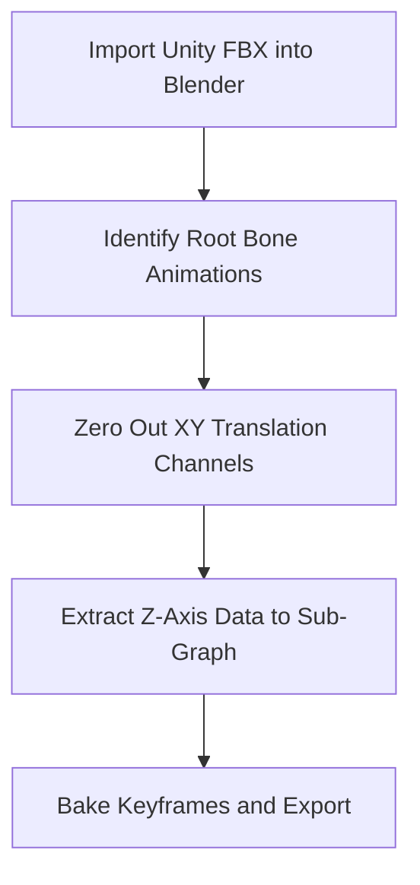

# Unity to Fallout 4 Animated Asset Architecture Formula

This guide defines a reliable conversion pipeline for moving animated Unity assets into Fallout 4 while preserving rig integrity, vertex weights, and animation behavior compatibility.

---

## Core Workflow Formula (Unity → Blender → Fallout 4)

To move animated Unity assets into Fallout 4 via Blender and the Creation Kit (CK), reconcile Unity’s engine-level animation model with Fallout 4’s bone-weighted `.nif` and Havok `.hkx` behavior graph system.

### 1) Asset Extraction (Unity to Blender)

Unity stores animations separately from meshes or bakes them into `.fbx` files.

- **Tool:** AssetRipper or AssetStudio  
- **Mesh Export:** Export mesh + associated avatar/skeleton as **FBX (Binary)**  
- **Animation Export:** Export animation clips (`.anim`) converted to FBX animation tracks

### 2) Blender Setup and Import

Blender requires Fallout-aware plugin setup to avoid format loss.

- **Tools:** Blender 3.x/4.x + PyNifly  
- **Import:** Import the Unity FBX
- **Scale Correction:** Unity is meter-based while Fallout 4 uses a different unit scale. Start from a `~70x` baseline for humanoid assets and tune against a matching vanilla reference in Blender for final world fit, then apply transforms (`Ctrl + A`)

### 3) Rigging and Bone Renaming (Translation Layer)

Fallout 4 requires strict skeleton naming and hierarchy consistency.

- **Actors/Creatures:** Rename Unity bones to match exact names of the target vanilla FO4 skeleton  
- **Static Animated Objects:** Use valid root naming (for example `Bip01`) or standard object physics node structures  
- **Weights:** Rebind/verify vertex groups so all deformation weights map to renamed bones

### 4) Animation Baking and PyNifly Export

Fallout 4 separates visual mesh data from runtime animation logic.

- **Bake:** In Blender Action Editor, bake actions with **Visual Keying** and **Clear Constraints**
- **Mesh Export (`.nif`):**
  - Select mesh + armature
  - Export via PyNifly (`NetImmerse`)
  - Target game: **Fallout 4**
  - Enable vertex weight export for rigged assets
- **Animation Track Export:** Export baked armature to FBX for Havok compilation flow (or use a dedicated Blender-to-Havok exporter if available)

### 5) Havok Processing (Missing Link)

The CK cannot consume raw Blender animation data directly.

- **Tooling:** Fallout 4 Animation Kit (F4AK) / Elrich
- **Process:** Compile exported animation FBX into FO4-compatible `.hkx`

### 6) Creation Kit Integration

Place outputs under `Data/Meshes/` and `Data/Animations/`, then wire forms:

- **World Objects:** Create `Furniture` or `MovableStatic`, point model to `.nif`, connect behavior/trigger route for animation
- **Characters/Creatures:** Create `Actor`/`Race`, assign visual `.nif`, map `.hkx` through animation keywords or custom subgraphs

---

## Architectural Formula: Animated World Objects, Weapons, and Creatures

Use three distinct processing tracks in Blender + PyNifly + CK.

---

## Track 1: Animated World Objects (Interactions and Loops)

World objects typically use embedded engine-driven controllers in `.nif` for loops, or behavior-driven interactions for activated states.

### 1) Blender Structure

- **Hierarchical Root:** Name base object node `Scene Root`
- **Collision Setup:** Parent low-poly collision mesh to root; assign custom property `BSNP_CollisionType` as `Static` or `AnimStatic`
- **Action Naming:**
  - Continuous loops: `Idle`
  - Interactions: `Play01` (activate) and `Play02` (deactivate)

### 2) PyNifly Export Matrix

- Set export profile: **Fallout 4 World Object**
- Enable **Export Animation Controller** to write transform tracks into `NiTransformInterpolator` blocks
- Enable **Embed Collision** when using PyNifly-generated convex collision

### 3) Creation Kit Integration

- **Continuous Loop:** Create `MovableStatic`, assign `.nif`; embedded loop tracks play automatically
- **User Triggered:** Create `Furniture` or `Activator`; use `DefaultActivateSelf.psc` or map animation groups so `Play01` fires on activation

---

## Track 2: Weapon Modules (First-Person Mesh and Transforms)

Weapon animation depends on transform fidelity relative to the first-person hand rig.

### 1) Blender Structure

- **Skeleton Alignment:** Import vanilla weapon skeleton (for example `Rig_Weapon.nif`) through PyNifly
- **Bone Matching:** Parent Unity weapon parts (trigger, magazine, bolt) to corresponding vanilla bones (`Trigger`, `Mag`, `Bolt`)
- **Keyframing:**
  - `Idle`: subtle movement on master weapon bone
  - `Reload`: animate `Mag` detachment and translation with proper timing

### 2) PyNifly Export Matrix

- Set export profile: **Fallout 4 Weapon**
- Enable **Export Vertex Weights** (skin partitioning required for moving components)
- Keep **Flatten Hierarchy** disabled to preserve OMOD transform relationships

### 3) Creation Kit Integration

- Create `Weapon` form and assign the master `.nif` as first-person model
- Map interactions with animation keywords (for example `AnimReloadWeapon`) so behavior graph states trigger the intended bone transforms

---

## Track 3: Creatures and Characters (Rigged Skin and Havok Graphs)

Creatures and characters require skin-partitioned meshes driven by external `.hkx` runtime files.

### 1) Blender Structure

- **Retargeting:** Retarget Unity armature to the target vanilla creature skeleton (`Skeleton.nif`) using a bone-renaming map
- **Skin Weights:** Normalize all vertex groups and enforce FO4 limit of max 4 bone influences per vertex
- **Bake Path:** Bake actions with keyframe cleanup for runtime efficiency

### 2) PyNifly Export Matrix

- Set export profile: **Fallout 4 Character/Creature**
- Enable **Export Vertex Weights**
- Set max influences to **4**
- Enable **Generate Skin Partition** to produce `BSDismembermentSkinInstance` blocks

### 3) Havok Processing Pipeline

- Export animation tracks from Blender as FBX
- Open **Elrich** (`Fallout 4/Tools/PC_Animation_Kit/`)
- Compile to runtime `.hkx` (example: `Creature_Idle.hkx`)

### 4) Creation Kit Integration

- Create a new `Race` and set skeleton path
- Create an `Actor` using that race
- In Animation Subgraph configuration, register custom `.hkx` tracks in graph descriptors and map to expected behavior states (such as alert/sneak state logic)

---

## Practical Validation Checklist

- Bone names match target FO4 skeleton exactly
- No vertex exceeds 4 bone influences for character/creature paths
- Transforms are applied before export
- `.nif` loads correctly in NifSkope/CK
- `.hkx` compiles and binds to expected graph states
- CK forms trigger the correct idle/activate/reload/creature states at runtime

---

## Elrich FBX-to-HKX Automation Script

Save this as `compile_anims.py` inside `Fallout 4/Tools/PC_Animation_Kit/`.

```python
import os
import subprocess

# Directory Setup
FBX_DIR = os.path.abspath("./FBX_Input")
HKX_DIR = os.path.abspath("./HKX_Output")
ELRICH_EXE = os.path.abspath("./elrich.exe")

os.makedirs(FBX_DIR, exist_ok=True)
os.makedirs(HKX_DIR, exist_ok=True)

def generate_template(fbx_name, fbx_path, hkx_path):
    """Generates the required job XML for Elrich processing."""
    return f"""<?xml version="1.0" encoding="utf-8"?>
<Job>
    <InputFile>{fbx_path}</InputFile>
    <OutputFile>{hkx_path}</OutputFile>
    <ProcessType>Animation</ProcessType>
    <SkeletonType>Humanoid</SkeletonType>
    <CompressionLevel>Standard</CompressionLevel>
</Job>
"""

def compile_animations():
    fbx_files = [f for f in os.listdir(FBX_DIR) if f.endswith(".fbx")]

    if not fbx_files:
        print(f"No FBX files found in {FBX_DIR}. Add files and restart.")
        return

    for fbx in fbx_files:
        name_only = os.path.splitext(fbx)[0]
        fbx_path = os.path.join(FBX_DIR, fbx)
        hkx_path = os.path.join(HKX_DIR, f"{name_only}.hkx")
        xml_job_path = os.path.join(FBX_DIR, f"{name_only}_job.xml")

        # Write job configuration file
        with open(xml_job_path, "w", encoding="utf-8") as xml_file:
            xml_file.write(generate_template(name_only, fbx_path, hkx_path))

        print(f"Compiling: {fbx} -> {name_only}.hkx")

        # Execute Elrich Compiler CLI via subprocess
        result = subprocess.run(
            [ELRICH_EXE, "-job", xml_job_path],
            capture_output=True,
            text=True,
            check=False,
        )

        # Cleanup temporary job file
        if os.path.exists(xml_job_path):
            os.remove(xml_job_path)

        if result.returncode != 0:
            print(f"Error compiling {fbx}:\n{result.stderr}")
        else:
            print(f"Successfully compiled: {name_only}.hkx")

if __name__ == "__main__":
    compile_animations()
```

---

## Papyrus Interactive Animation Trigger Template

Attach this script to custom `Activator` or `Furniture` forms in CK to control activation/open-close flow and interaction locking.

```papyrus
Scriptname ModName:AnimatedInteractiveObject extends ObjectReference
; Custom Papyrus script to handle interaction states for custom animated assets.

Group Animation_Settings
    String Property AnimationOpenName = "Play01" Auto Const
    {The editor name of the activation/opening animation track inside the NIF.}

    String Property AnimationCloseName = "Play02" Auto Const
    {The editor name of the deactivation/closing animation track inside the NIF.}

    Message Property FailureMessage Auto Const
    {Optional: Message to show if the object is busy or locked.}
EndGroup

; State variables
Bool isVisualStateOpen = false
Bool isEngineBusy = false

Event OnActivate(ObjectReference akActionRef)
    ; Prevent script spamming during an ongoing animation sequence
    If (isEngineBusy)
        If (FailureMessage)
            FailureMessage.Show()
        EndIf
        Return
    EndIf

    isEngineBusy = true
    EvaluateAndPlayAnimation(akActionRef)
EndEvent

Function EvaluateAndPlayAnimation(ObjectReference akActor)
    If (!isVisualStateOpen)
        ; State: Closed -> Playing Opening Loop
        Self.PlayAnimation(AnimationOpenName)

        ; Register to listen for the specific text keyframe event embedded in the NIF graph
        Self.RegisterForAnimationEvent(Self, "End")

        isVisualStateOpen = true
    Else
        ; State: Open -> Playing Closing Loop
        Self.PlayAnimation(AnimationCloseName)
        Self.RegisterForAnimationEvent(Self, "End")

        isVisualStateOpen = false
    EndIf
EndFunction

Event OnAnimationEvent(ObjectReference akSource, string asEventName)
    If (akSource == Self && asEventName == "End")
        ; Safely unblock the interaction pipeline once animation frames stop processing
        Self.UnregisterForAnimationEvent(Self, "End")
        isEngineBusy = false
    EndIf
EndEvent
```

---

## Student Assessment Rubric: Vertex Weight and Deform Debugging

| Diagnostic Test / Error | Visual Symptom in CK / Game | Root Cause in Blender Workflow | Corrective Action Blueprint |
| --- | --- | --- | --- |
| Exploding Vertices | Mesh stretch points spike toward world origin `(0,0,0)` | Unweighted vertices or vertex groups that do not match valid skeleton bone names | Select broken mesh region, remove bad assignments from groups, then manually reassign to correct active bone vertex groups |
| Rigid Deformations | Mesh bends like cardboard; limbs shear instead of deforming smoothly | Vertices exceed FO4 influence limit (>4 bones) and runtime clips assignments | In Weight Paint: `Weights -> Limit Total`, set limit to `4` |
| Invisible Rigged Mesh | Mesh appears in preview but disappears in first-person/live world | Missing `BSDismembermentSkinInstance` and/or unapplied transforms | Apply transforms (`Ctrl + A -> All Transforms`) and re-export with **Generate Skin Partition** enabled |
| Desynced Collision | Visual mesh animates but click/hit collision remains at original location | Collision geometry parented to incorrect node layer | Re-parent collision mesh to the active animated sub-bone instead of top-level root |

---

## Blender PyNifly Export Profile Defaults

To keep exports consistent, set these values and save a preset named `FO4_Animated_Asset_Default`.

### Setup Steps

1. Select the final mesh and armature in the viewport
2. Go to `File -> Export -> NetImmerse (.nif)`
3. Configure export properties using the matrix below
4. Click `+ (New Preset)` and save as `FO4_Animated_Asset_Default`

### Configuration Properties Matrix

| Export Property | Required Value | Technical Function |
| --- | --- | --- |
| Game Target | Fallout 4 | Sets FO4-compatible file headers and modern block syntax |
| Export Profile | Default or Rigged | Uses `NiNode`-based hierarchy for FO4 asset structure |
| Export Vertex Weights | Enabled | Compiles mesh vertex groups into skin clusters |
| Flatten Hierarchy | Disabled | Preserves bone hierarchy required for animation |
| Generate Skin Partition | Enabled | Splits geometry for FO4 runtime skin partition constraints |
| Maximum Bones per Vertex | `4` | Enforces runtime-safe influence limit |
| Embed Collision | Enabled | Generates collision hull output with mesh export |
| Collision Type | Convex Hull | Produces performance-friendly collision volumes |

---

## Mandatory Directory Manifest Checklist

Place outputs under the exact `Fallout 4/Data/` structure below to avoid missing-asset or red-exclamation errors.

```text
Fallout 4/Data/
│
├── Meshes/
│   └── ModName/
│       ├── WorldObjects/
│       │   └── custom_object.nif
│       │
│       ├── Weapons/
│       │   └── custom_weapon.nif
│       │
│       └── Actors/
│           └── CustomCreature/
│               ├── CharacterMesh.nif
│               └── Skeleton.nif
│
├── Animations/
│   └── ModName/
│       ├── custom_object_open.hkx
│       ├── custom_weapon_reload.hkx
│       └── custom_creature_idle.hkx
│
└── Materials/
    └── ModName/
        └── custom_texture_properties.bgsm
```

---

## Troubleshooting Module: Unity Mecanim Root Motion Conversion

Unity Mecanim often bakes motion into root transforms, which can cause snapping, teleporting, or floating when used directly in Fallout 4.

### Root Cause

Unity stores local bone transforms relative to a moving engine origin, while Fallout 4 expects locomotion/state movement to be driven by behavior graph logic, with root nodes (`Bip01` / `Scene Root`) stable around local origin during looped clips.

### Step-by-Step Fix Pipeline



1. **Isolate Root Transform Channel**
   - Open Blender Graph Editor
   - Expand armature channels and identify root bone track (`Root`, `Hips`, or `Bip01`)
2. **Strip Horizontal Drift (X/Y)**
   - Select `X Location` and `Y Location` curves
   - Delete keyframes to lock horizontal movement drift
3. **Stabilize Vertical Drift (Z)**
   - Review `Z Location` curve for jump/crouch behavior
   - Add `Cycles` modifier where needed for clean looping behavior
4. **Bake Restabilized Action**
   - Select armature in Object Mode
   - Use `Object -> Animation -> Bake Action`
   - Enable **Visual Keying** and **Clear Constraints**
   - Match bake frame range to original clip length

This preserves sub-bone animation while keeping the master root stable for FO4 behavior-graph-driven runtime movement.

---

## Student Laboratory Exercise Worksheet

**Course Module:** Advanced Modding – Asset Conversion Pipelines  
**Objective:** Convert a rigged Unity asset into a functional Fallout 4 world object with an interaction loop.

### Required Assets Checklist

- `unity_asset_input.fbx` (mesh + skeleton)
- `unity_idle_clip.anim` (raw animation data)
- Python 3.10+ environment configured with `compile_anims.py`

### Step 1: Geometry and Scale Correction (Estimated: 10 min)

1. Open a clean scene in Blender 4.2+ and delete default scene objects
2. Import `unity_asset_input.fbx`
3. Select armature + mesh
4. Scale (`S`) to `100`
5. Apply transforms (`Ctrl + A -> All Transforms`)

**Checkpoint Question:** What are Scale X/Y/Z values after applying transforms?  
**Expected Answer:** `1.000` for X, Y, and Z.

### Step 2: Retargeting and Hierarchy Cleanup (Estimated: 15 min)

1. In Outliner/Data view, find top-level parent/root bone
2. Rename root from `GameObject_Root` to `Scene Root`
3. In Action Editor, rename imported action to `Play01`
4. Scrub timeline and verify clean loop from frame 1 to frame 60

### Step 3: PyNifly Compilation Challenge (Estimated: 10 min)

1. Select mesh + root armature
2. Go to `File -> Export -> NetImmerse (.nif)`
3. Load `FO4_Animated_Asset_Default`
4. Export as `lab_asset_output.nif`

---

## BGSM Material Batch Automation Tool

Use this standalone script to generate `.bgsm` JSON-structured material specs from texture folders with consistent relative pathing.

```python
import os
import json

# Setup targeting directories
TEXTURES_DIR_RELATIVE = "Textures\\ModName\\CustomAssets\\"
BGSM_OUTPUT_DIR = "./BGSM_Output"

os.makedirs(BGSM_OUTPUT_DIR, exist_ok=True)

def create_bgsm_template(material_name):
    """Returns a dictionary payload mirroring a FO4 BGSM-style structure."""
    return {
        "Version": 2,
        "MaterialType": "BGSM",
        "TileFlags": {
            "Tile_U": True,
            "Tile_V": True
        },
        "TexturePaths": {
            "Diffuse": f"{TEXTURES_DIR_RELATIVE}{material_name}_d.dds",
            "Normal": f"{TEXTURES_DIR_RELATIVE}{material_name}_n.dds",
            "Specular": f"{TEXTURES_DIR_RELATIVE}{material_name}_s.dds"
        },
        "ShaderProperties": {
            "Alpha": 1.0,
            "Smoothness": 0.8,
            "Glossiness": 0.5,
            "EmitColor": [0.0, 0.0, 0.0],
            "SpecularColor": [1.0, 1.0, 1.0]
        }
    }

def batch_generate_bgsm(target_folder):
    # Locate diffuse textures to verify material base presence
    diffuse_files = [f for f in os.listdir(target_folder) if f.endswith("_d.dds")]

    if not diffuse_files:
        print("No diffuse maps (*_d.dds) located inside your target source path.")
        return

    for item in diffuse_files:
        base_name = item.replace("_d.dds", "")
        bgsm_payload = create_bgsm_template(base_name)

        output_file_path = os.path.join(BGSM_OUTPUT_DIR, f"{base_name}.bgsm")
        with open(output_file_path, "w", encoding="utf-8") as f:
            json.dump(bgsm_payload, f, indent=4)

        print(f"Generated Material Spec File: {base_name}.bgsm")

if __name__ == "__main__":
    # Point this variable to your raw textures working folder
    BATCH_SOURCE_FOLDER = "./SampleTextures"
    os.makedirs(BATCH_SOURCE_FOLDER, exist_ok=True)
    batch_generate_bgsm(BATCH_SOURCE_FOLDER)
```

---

## Optimization Module: Poly Count and Performance Limits

The Creation Engine can become unstable when imported assets exceed practical runtime budgets.

### Hard Structural Constraints

- **Static Props / Interactables:** target up to ~15,000 polygons per mesh object
- **Characters / Dynamic Rigged Assets:** target up to ~45,000 polygons total
- **Texture Sheets:** typically 2K (`2048x2048`) for general assets; up to 4K (`4096x4096`) for hero views (weapons/faces)

### Optimization Pipeline in Blender

```text
Import High-Poly Asset -> Decimate Modifier (Collapse Ratio) -> Triangulate Pass -> Clear Custom Split Normals Data
```

### Practical Steps

1. **Decimate Pass**
   - Add `Decimate` modifier in `Collapse` mode
   - Reduce ratio progressively (for example `1.0 -> 0.4`) until polygon budget is acceptable
2. **Triangulation Pass**
   - Add `Triangulate` modifier below `Decimate`
   - Ensure export-ready triangle topology for FO4 runtime
3. **Clear Split Normals**
   - In Object Data Properties, open geometry data and clear custom split normals
   - Removes Unity-imported normal artifacts that can cause black faceting in CK

---

## Creation Kit Havok Animation Repair Blueprint

When `.hkx` compiles but fails in CK, diagnose graph, path, and event-tag mismatches.

```text
[Engine Crash / T-Pose]
       |
       v
Check Character Subgraph Selection --(Default Humanoid?)--> NO --> Assign Custom Race Skeleton Path
       |
      YES
       v
Inspect Text Keyframe Tags --(Missing "End" Tag?)--> YES --> Re-inject Markers in Action Editor
       |
       NO
       v
Run Havok Behavior Tool (HBT) Sanity Verification Pass
```

### Step 1: Fix Runtime T-Pose

**Symptom:** Actor remains in default T-pose when clip is called.  
**Root Cause:** `.hkx` path or naming mismatch against animation subgraph descriptor.  
**Fix:**
- Verify actual compiled filename and path
- Align naming with behavior node references (for example `Idle.hkx` vs `custom_idle.hkx`)
- Ensure descriptor paths are correctly rooted relative to game data conventions

### Step 2: Fix Missing Event Marker Triggers

**Symptom:** Loop plays once, then freezes or crashes on repeat.  
**Root Cause:** Missing animation event marker expected by script (`End`).  
**Fix:**
- Open Action Editor in Blender
- Add final-frame marker named `End`
- Re-export and recompile

---

## Quick-Reference Mod Packaging Cheat Sheet (.ba2)

For public distribution, package assets into `.ba2` archives instead of loose files.

### Archive2 Setup

- Tool path: `Fallout 4/Tools/Archive2/Archive2.exe`
- In Archive2 settings, set Root Folder to active `Fallout 4/Data/` workspace

### Packaging Matrix Rules

| Target File Types | Required BA2 Format | Compression Setting | Technical Reason |
| --- | --- | --- | --- |
| `.nif`, `.hkx`, `.bgsm` | General | Default (Compressed) | Structural and metadata-heavy assets compress efficiently |
| `.dds` (textures) | DX10 / Texture | None (Uncompressed container) | Archive2 repacks textures into engine-ready texture stream format |

### CLI Automation Commands

```cmd
:: Main data package
"Archive2.exe" "Data\ModName - Main.ba2" -create -format=General -root="Data\SourceFiles\"

:: Texture package
"Archive2.exe" "Data\ModName - Textures.ba2" -create -format=Texture -root="Data\SourceTextures\"
```

---

## Syllabus Outline: 4-Week Asset Modding Course

### Week 1: Asset Rigging and Scale Foundations

- **Lecture:** Unity Mecanim conversion rules and scale translation fundamentals
- **Lab:** Import FBX, clear split normals, align bone structure to target hierarchy
- **Milestone:** Export a clean `.nif`

### Week 2: Animation Pipelines and Weight Distribution

- **Lecture:** Bone influence limits and Action Editor workflow
- **Lab:** Remove horizontal root drift, paint/test weights with limit-total workflow
- **Milestone:** Export baked animation track to FBX

### Week 3: Havok Compiling and Material Automation

- **Lecture:** Elrich CLI patterns and material mapping structure
- **Lab:** Batch-generate `.bgsm` specs and compile animation clips to `.hkx`
- **Milestone:** Produce valid on-disk FO4 asset structure

### Week 4: Creation Kit Integration and Distribution

- **Lecture:** Scripted event flow and archive packaging strategy
- **Lab:** Wire interactive logic in CK and package release with Archive2
- **Milestone:** Run a working interactive world asset in game

---

## Week 4 Final Project Grading Rubric

Use this rubric to score final student asset submissions.

| Assessment Category | Exceptional (90-100%) | Satisfactory (70-80%) | Unsatisfactory (<70%) |
| --- | --- | --- | --- |
| Skeletal & Mesh Integrity | All transforms applied, weights constrained to valid per-vertex limits, no visible tearing | Transforms applied, minor weight clipping without major deformation | Exploding vertices, severe distortion, or unapplied transforms causing scale/runtime errors |
| Animation Fidelity | Root motion corrected, loops are seamless, required event tags present | Animations run with minor loop/alignment issues | Interaction crash/freeze due to missing or invalid animation event tags |
| Asset Directory Compliance | Pathing matches required FO4 structure exactly | Assets load but organization/path naming is inconsistent | Missing-path errors, red exclamation markers, or failed loads |
| Archive Optimization | Correct General/Texture `.ba2` separation with proper settings | Archives build but include avoidable format/compression mistakes | Loose-file submission or oversized/invalid package structure |

---

## Printable Reference Sheet: Papyrus Animation API

Quick-reference functions for object and actor animation scripting in CK.

### Critical Object Animation Methods

- `PlayAnimation(string asAnimName) -> Bool`  
  **Purpose:** Plays embedded `.nif` transform animation/controller tracks.  
  **Example:** `Self.PlayAnimation("Play01")`

- `PlaySubGraphAnimation(string asEventName)`  
  **Purpose:** Triggers behavior-subgraph animation events for actors/creatures.  
  **Example:** `akActorRef.PlaySubGraphAnimation("Reset")`

### Core Registration Events

- `RegisterForAnimationEvent(ObjectReference akSource, string asEventName)`  
  **Purpose:** Registers a script listener for animation event payloads.  
  **Example:** `Self.RegisterForAnimationEvent(Self, "End")`

- `UnregisterForAnimationEvent(ObjectReference akSource, string asEventName)`  
  **Purpose:** Unregisters listeners to avoid stale handles and unnecessary script overhead.

### Safety and Verification Methods

- `HasAnimationVariableBool(string asVarName) -> Bool`  
  **Purpose:** Checks whether a specific animation bool variable exists in active graph state.

- `SetAnimationVariableBool(string asVarName, bool abValue)`  
  **Purpose:** Toggles graph bool state flags during runtime behavior control.  
  **Example:** `akActorRef.SetAnimationVariableBool("bIsAttacking", true)`

---

## Troubleshooting Guide: Black Texture and Shader Failures

Use this blueprint when assets render black or lose expected specular response in CK.

```text
[Pitch Black Mesh Render]
           |
           v
Verify Texture Directory Pathing --(Relative Path Used?)--> NO --> Strip Drive Letter (Keep Data\...)
           |
          YES
           v
Check Lighting Shader Flag Settings --(Has Vertex Colors Checked?)--> YES --> Disable/Correct Flag in Material Setup
           |
           NO
           v
Run BC7 Compression Verification Pass on Alpha Channels
```

### Step 1: Repair Absolute Local Paths

**Root Cause:** `.bgsm` references absolute machine-local paths (for example `C:\...`) that break on other systems.  
**Fix:** Ensure material texture paths are relative (`Textures\ModName\...`) and portable.

### Step 2: Resolve Vertex Color Flag Conflicts

**Root Cause:** Shader/material expects vertex color channels but mesh lacks color attributes.  
**Fix:**
- In Blender, select target mesh
- Open Object Data Properties and review Color Attributes
- If empty, create a default color layer (for example `Col`)
- Re-export through PyNifly

### Step 3: Correct DDS Format Compatibility

**Root Cause:** Non-FO4-ready texture formats and/or incompatible compression settings.  
**Fix:**
- Convert textures to FO4-compatible DDS format
- Typical choices: `BC1/DXT1` for opaque diffuse, `BC7` for higher-fidelity RGBA use cases
- Keep power-of-two dimensions (for example `1024x1024`, `2048x2048`, `4096x4096` as appropriate)

---

## Interactive Papyrus Script Debugging Challenges

Use these intentionally broken scripts as student code-review exercises.

### Challenge A: Locked Interaction Bug

**Scenario:** Activation plays once, then object locks permanently.  
**Assignment:** Find two structural bugs.

```papyrus
; DEFECTIVE SCRIPT - FOR STUDENT REVIEW
Scriptname ModName:BrokenLeverScript extends ObjectReference

String Property AnimationName = "Play01" Auto Const
Bool isAnimating = false

Event OnActivate(ObjectReference akActionRef)
    if (isAnimating == true)
        return
    endif

    isAnimating = true
    Self.PlayAnimation(AnimationName)
    ; STUCK POINTER: Student forgot to register for the termination event string key here
EndEvent

Event OnAnimationEvent(ObjectReference akSource, string asEventName)
    if (asEventName == "End")
        isAnimating = false
        ; CRITICAL DEFECT: Missing a mandatory clear function call to free up the listener handle
    endif
EndEvent
```

**Instructor Answer Key**
- Bug 1: Missing `Self.RegisterForAnimationEvent(Self, "End")` in `OnActivate`
- Bug 2: Missing `Self.UnregisterForAnimationEvent(Self, "End")` in `OnAnimationEvent`

### Challenge B: Non-Thread-Safe Gate Trigger

**Scenario:** Simultaneous activations desync state and animation.  
**Assignment:** Re-architect with state-based lock control.

```papyrus
; DEFECTIVE SCRIPT - FOR STUDENT REVIEW
Scriptname ModName:BrokenGateScript extends ObjectReference

String Property OpenAnim = "Play01" Auto Const
Bool Property IsOpen = false Auto

Event OnActivate(ObjectReference akActionRef)
    ; LOGIC CRASH: If two actors press activate simultaneously, both bypass this line before IsOpen flips
    if (IsOpen == false)
        IsOpen = true
        Self.PlayAnimation(OpenAnim)
    endif
EndEvent
```

**Instructor Answer Pattern**

```papyrus
Auto State Ready
    Event OnActivate(ObjectReference akActionRef)
        GoToState("Busy")
        IsOpen = !IsOpen
        Self.PlayAnimation(OpenAnim)
        Self.RegisterForAnimationEvent(Self, "End")
    EndEvent
EndState

State Busy
    Event OnActivate(ObjectReference akActionRef)
        ; Do nothing while busy processing frames
    EndEvent
EndState
```

---

## Student Weekly Milestone Tracking Checklist

### Week 1: Import and Base Scaling Setup

- Mesh/skeleton extracted from Unity using AssetRipper/AssetStudio
- Asset scaled uniformly in Blender and transforms applied
- Scale values confirmed as `1.000` after apply
- Custom split normals cleared where required

### Week 2: Skeleton Optimization and Weight Painting

- Root bone renamed correctly (`Scene Root`) or aligned to vanilla target node structure
- Weight influence limit pass applied (max 4 influences per vertex)
- Root-motion horizontal drift removed from X/Y channels
- `End` marker embedded for script event handoff

### Week 3: Compiling and Directory Staging

- `.hkx` generated successfully from Elrich pipeline
- Textures converted to power-of-two DDS formats (`BC1`/`BC7` as needed)
- Material paths use game-relative structure
- Meshes, animations, and materials staged under correct `Data/` folders

### Week 4: Assembly and Final Archiving

- CK resolves assets with no red exclamation markers
- State-safe Papyrus logic compiled and attached
- Archive2 packaging completed as separate `- Main.ba2` and `- Textures.ba2`
- Final in-game validation completed in live save

---

## Next-Gen Runtime Patch Compatibility Blueprint

Use this strategy when engine/runtime updates alter behavior graph layouts.

### 1) Decouple via Custom Animation Subgraphs

Do not overwrite global base animation registry files.  
Instead, isolate mod behavior through custom animation groups/subgraphs and plugin-scoped records (`.esp`), so core updates do not overwrite mod state routing.

### 2) Resolve Runtime Pointer/Format Breakage

When toolchain updates alter expected HKX structure:

- Recompile using the latest FO4 animation toolkit components
- Update processing flags where applicable (example below)

```xml
<ProcessType>Animation64</ProcessType>
```

Validate output against expected modern runtime profiles, including file size and load behavior consistency.

### 3) Preserve Dynamic Form IDs

Avoid hardcoded form IDs in scripts; use Creation Kit property wiring.

**Bad practice**

```papyrus
Game.GetFormFromFile(0x01004F3C, "MyMod.esp")
```

**Preferred practice**

```papyrus
Weapon Property MyCustomWeapon Auto Const
; Creation Kit resolves this dynamically based on runtime load order.
```

---

## Creation Kit Error Message Quick-Reference Dictionary

| Error Message String | True Root Cause | Immediate Actionable Fix |
| --- | --- | --- |
| `MASTERFILE: Model... has no texture mapping info.` | Missing/corrupt `BSLightingShaderProperty` data | Reassign material in Blender and re-export with valid PyNifly preset |
| `ANIMATION: Cannot find animation graph for Actor...` | Race/Actor graph path points to invalid or missing subgraph/skeleton structure | Correct graph path fields in CK to match staged folders |
| `FORMS: Subgraph requested event that does not exist.` | Script/engine calls animation marker not present in `.hkx` | Verify marker spelling/case in Blender timeline, then recompile |
| `CONTROLLER: NiTransformController targets missing node.` | Animation track points to renamed/missing bone node | Align action bone names with final skeleton/vertex group naming |

---

## In-Game Console Animation Debugging Guide

### `ToggleAnimationDebug` (`tad`)

- **Usage:** open console and enter `tad`
- **Purpose:** overlays active animation graph states in real time

### `PlayBGSAnimGame [EditorID] [AnimName]`

- **Usage:** target object, then run e.g. `PlayBGSAnimGame Play01`
- **Purpose:** bypasses Papyrus and directly tests embedded animation controller playback

### `DumpAnimationGraphs` (`dag`)

- **Usage:** target actor, then run `dag`
- **Purpose:** exports current actor graph details for log-based diagnostics

### `SetAnimGraphVar [VarName] [Value]`

- **Usage:** e.g. `SetAnimGraphVar bIsAlert true`
- **Purpose:** forces animation graph variable state transitions for rapid testing

---

## End-of-Course Capstone Project Prompt

### Project Assignment: The Automated Security Outpost

Students must integrate world object, weapon, and creature pipelines into a single interactive settlement defense mod.

### Technical Specification Requirements

1. **Object Module (Animated Structure)**  
   Import a Unity mechanical terminal/cage object and drive activation with a thread-safe Papyrus script loop.
2. **Weapon Module (Custom Attachment)**  
   Rig a custom defense/turret weapon component to vanilla weapon bones with working reload animation behavior.
3. **Creature Module (Guardian Unit)**  
   Retarget a Unity robot/synthetic creature to a vanilla-compatible skeleton with validated weights and compiled loop track.
4. **Final Deployment Packaging**  
   Package plugin + assets into optimized distribution-ready archives for end-user installation.

---

## Automated Student Grading Scorecard Template (Python)

Use this script template to calculate weighted final scores and output markdown feedback.

```python
def calculate_student_grade(student_name, metrics):
    """Calculates weighted scores and generates a structural grading evaluation report."""
    weights = {
        "mesh_integrity": 0.25,
        "animation_fidelity": 0.25,
        "directory_compliance": 0.25,
        "archive_optimization": 0.25
    }

    total_score = sum(metrics[key] * weights[key] for key in weights)

    letter_grade = "F"
    if total_score >= 90:
        letter_grade = "A"
    elif total_score >= 80:
        letter_grade = "B"
    elif total_score >= 70:
        letter_grade = "C"
    elif total_score >= 60:
        letter_grade = "D"

    report = f"""
### 🎓 Evaluation Report: {student_name}
* **Final Score:** {total_score:.1f}%
* **Letter Grade:** {letter_grade}

#### Criteria Performance
* 📦 **Mesh & Weight Integrity (25%):** {metrics['mesh_integrity']}/100
* 🎬 **Animation Graph Fidelity (25%):** {metrics['animation_fidelity']}/100
* 📁 **Directory Standard Compliance (25%):** {metrics['directory_compliance']}/100
* 💾 **Archive Pack Optimization (25%):** {metrics['archive_optimization']}/100
"""
    return report

# Instructor grading execution sample
student_metrics = {
    "mesh_integrity": 95,
    "animation_fidelity": 88,
    "directory_compliance": 100,
    "archive_optimization": 90
}
print(calculate_student_grade("Alex Mercer", student_metrics))
```

---

## Student Troubleshooting Flowchart (Text Layout)

```text
[My Mod is Broken / Crashing / Glitching]
 |
 +--> Is the asset invisible in-game or showing a red exclamation triangle?
 |    +--> YES: Verify paths under Data/Meshes/... and Data/Animations/...
 |    +--> NO: Continue
 |
 +--> Does the engine crash/freeze when animation triggers?
 |    +--> YES: Run Limit Total and enforce <= 4 influences per vertex
 |    +--> NO: Continue
 |
 +--> Is the asset pitch-black or missing textures?
 |    +--> YES: Fix .bgsm paths to be game-relative (no absolute drive paths)
 |    +--> NO: Continue
 |
 +--> Does animation play once and then fail?
      +--> YES: Verify script state logic and UnregisterForAnimationEvent() usage
      +--> NO: Run tad (ToggleAnimationDebug) and inspect graph state
```

---

## Course Welcome and Onboarding Email Template

```text
Subject: Welcome to Advanced Modding: Unity to Creation Kit Asset Pipeline

Hello Developer,

Welcome to the Advanced Modding course. Over the next 4 weeks, you will learn how to convert animated Unity assets and deploy them directly into the Fallout 4 Creation Kit engine pipeline.

This course moves past static model porting. You will work with skeletal weight distribution, custom Havok (.hkx) animation graphs, and thread-safe Papyrus interaction scripts.

Required software before Week 1:
1. Blender (4.2 LTS or newer)
2. PyNifly Blender add-on (latest stable)
3. Fallout 4 Creation Kit + animation toolchain
4. Python (3.10+)
5. Code editor (VS Code or Notepad++)

Review Week 1 materials and complete your workspace folder setup before the first lab.

Best regards,
Course Instructor
```

---

## Creation Kit Papyrus Debug Logging Setup Cheat Sheet

By default, runtime script errors can be difficult to diagnose. Enable logging to capture traces and stack issues.

### Step 1: Configure `Fallout4Custom.ini`

Open `Documents\My Games\Fallout4\Fallout4Custom.ini` and add/update:

```ini
[Papyrus]
bEnableLogging=1
bEnableTrace=1
bEnableDebugInformation=1
bLogUnhandledArgs=1
```

### Step 2: Configure `CreationKit.ini`

Open `CreationKit.ini` in your Fallout 4 install and verify:

```ini
[Messages]
bBlockAllWarnings=0
bShowWarnings=1
bEnableMetaLog=1
```

### Step 3: Locate Runtime Output

- Log file: `Documents\My Games\Fallout4\Logs\Script\Papyrus.0.log`
- Common errors:
  - `cannot call [Function] on a None object` → missing/empty property assignment in CK
  - `stack overflow` → infinite recursion/loop without state guard

---

## High-Quality Open-Source Asset Repository Resource Guide

Use sources with clean rigging and permissive licensing for curriculum reliability.

### 1) Sketchfab (Rigged Character/Object Repository)

- **Best for:** rigged creatures, weapons, mechanical objects
- **Selection:** filter for `Rigged` + `Animated`, export FBX
- **Advantage:** typically clean bone/weight data for retarget workflows

### 2) OpenGameArt.org (Community Public-Domain Assets)

- **Best for:** low-poly props, furniture, switches, doors
- **Selection:** prioritize CC0/CC-BY licensing
- **Advantage:** topology usually fits older-engine performance budgets

### 3) Unity Asset Store (Extraction Source Hub)

- **Best for:** motion clip libraries and complex mech/character assets
- **Selection:** choose free packages using Mecanim Humanoid rigs where possible
- **Advantage:** humanoid rig structures often map more predictably to FO4-style retargeting flows
