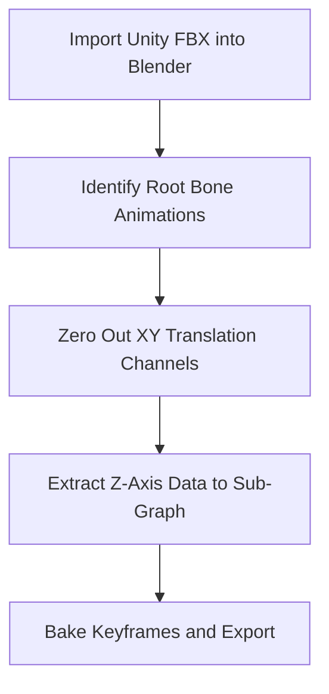

# Unity to Fallout 4 Animated Asset Architecture Formula

This guide defines a reliable conversion pipeline for moving animated Unity assets into Fallout 4 while preserving rig integrity, vertex weights, and animation behavior compatibility.

---

## Core Workflow Formula (Unity → Blender → Fallout 4)

To move animated Unity assets into Fallout 4 via Blender and the Creation Kit (CK), reconcile Unity’s engine-level animation model with Fallout 4’s bone-weighted `.nif` and Havok `.hkx` behavior graph system.

### 1) Asset Extraction (Unity to Blender)

Unity stores animations separately from meshes or bakes them into `.fbx` files.

- **Tool:** AssetRipper or AssetStudio  
- **Mesh Export:** Export mesh + associated avatar/skeleton as **FBX (Binary)**  
- **Animation Export:** Export animation clips (`.anim`) converted to FBX animation tracks

### 2) Blender Setup and Import

Blender requires Fallout-aware plugin setup to avoid format loss.

- **Tools:** Blender 3.x/4.x + PyNifly  
- **Import:** Import the Unity FBX
- **Scale Correction:** Unity is meter-based while Fallout 4 uses a different unit scale. Start from a `~70x` baseline for humanoid assets and tune against a matching vanilla reference in Blender for final world fit, then apply transforms (`Ctrl + A`)

### 3) Rigging and Bone Renaming (Translation Layer)

Fallout 4 requires strict skeleton naming and hierarchy consistency.

- **Actors/Creatures:** Rename Unity bones to match exact names of the target vanilla FO4 skeleton  
- **Static Animated Objects:** Use valid root naming (for example `Bip01`) or standard object physics node structures  
- **Weights:** Rebind/verify vertex groups so all deformation weights map to renamed bones

### 4) Animation Baking and PyNifly Export

Fallout 4 separates visual mesh data from runtime animation logic.

- **Bake:** In Blender Action Editor, bake actions with **Visual Keying** and **Clear Constraints**
- **Mesh Export (`.nif`):**
  - Select mesh + armature
  - Export via PyNifly (`NetImmerse`)
  - Target game: **Fallout 4**
  - Enable vertex weight export for rigged assets
- **Animation Track Export:** Export baked armature to FBX for Havok compilation flow (or use a dedicated Blender-to-Havok exporter if available)

### 5) Havok Processing (Missing Link)

The CK cannot consume raw Blender animation data directly.

- **Tooling:** Fallout 4 Animation Kit (F4AK) / Elrich
- **Process:** Compile exported animation FBX into FO4-compatible `.hkx`

### 6) Creation Kit Integration

Place outputs under `Data/Meshes/` and `Data/Animations/`, then wire forms:

- **World Objects:** Create `Furniture` or `MovableStatic`, point model to `.nif`, connect behavior/trigger route for animation
- **Characters/Creatures:** Create `Actor`/`Race`, assign visual `.nif`, map `.hkx` through animation keywords or custom subgraphs

---

## Architectural Formula: Animated World Objects, Weapons, and Creatures

Use three distinct processing tracks in Blender + PyNifly + CK.

---

## Track 1: Animated World Objects (Interactions and Loops)

World objects typically use embedded engine-driven controllers in `.nif` for loops, or behavior-driven interactions for activated states.

### 1) Blender Structure

- **Hierarchical Root:** Name base object node `Scene Root`
- **Collision Setup:** Parent low-poly collision mesh to root; assign custom property `BSNP_CollisionType` as `Static` or `AnimStatic`
- **Action Naming:**
  - Continuous loops: `Idle`
  - Interactions: `Play01` (activate) and `Play02` (deactivate)

### 2) PyNifly Export Matrix

- Set export profile: **Fallout 4 World Object**
- Enable **Export Animation Controller** to write transform tracks into `NiTransformInterpolator` blocks
- Enable **Embed Collision** when using PyNifly-generated convex collision

### 3) Creation Kit Integration

- **Continuous Loop:** Create `MovableStatic`, assign `.nif`; embedded loop tracks play automatically
- **User Triggered:** Create `Furniture` or `Activator`; use `DefaultActivateSelf.psc` or map animation groups so `Play01` fires on activation

---

## Track 2: Weapon Modules (First-Person Mesh and Transforms)

Weapon animation depends on transform fidelity relative to the first-person hand rig.

### 1) Blender Structure

- **Skeleton Alignment:** Import vanilla weapon skeleton (for example `Rig_Weapon.nif`) through PyNifly
- **Bone Matching:** Parent Unity weapon parts (trigger, magazine, bolt) to corresponding vanilla bones (`Trigger`, `Mag`, `Bolt`)
- **Keyframing:**
  - `Idle`: subtle movement on master weapon bone
  - `Reload`: animate `Mag` detachment and translation with proper timing

### 2) PyNifly Export Matrix

- Set export profile: **Fallout 4 Weapon**
- Enable **Export Vertex Weights** (skin partitioning required for moving components)
- Keep **Flatten Hierarchy** disabled to preserve OMOD transform relationships

### 3) Creation Kit Integration

- Create `Weapon` form and assign the master `.nif` as first-person model
- Map interactions with animation keywords (for example `AnimReloadWeapon`) so behavior graph states trigger the intended bone transforms

---

## Track 3: Creatures and Characters (Rigged Skin and Havok Graphs)

Creatures and characters require skin-partitioned meshes driven by external `.hkx` runtime files.

### 1) Blender Structure

- **Retargeting:** Retarget Unity armature to the target vanilla creature skeleton (`Skeleton.nif`) using a bone-renaming map
- **Skin Weights:** Normalize all vertex groups and enforce FO4 limit of max 4 bone influences per vertex
- **Bake Path:** Bake actions with keyframe cleanup for runtime efficiency

### 2) PyNifly Export Matrix

- Set export profile: **Fallout 4 Character/Creature**
- Enable **Export Vertex Weights**
- Set max influences to **4**
- Enable **Generate Skin Partition** to produce `BSDismembermentSkinInstance` blocks

### 3) Havok Processing Pipeline

- Export animation tracks from Blender as FBX
- Open **Elrich** (`Fallout 4/Tools/PC_Animation_Kit/`)
- Compile to runtime `.hkx` (example: `Creature_Idle.hkx`)

### 4) Creation Kit Integration

- Create a new `Race` and set skeleton path
- Create an `Actor` using that race
- In Animation Subgraph configuration, register custom `.hkx` tracks in graph descriptors and map to expected behavior states (such as alert/sneak state logic)

---

## Practical Validation Checklist

- Bone names match target FO4 skeleton exactly
- No vertex exceeds 4 bone influences for character/creature paths
- Transforms are applied before export
- `.nif` loads correctly in NifSkope/CK
- `.hkx` compiles and binds to expected graph states
- CK forms trigger the correct idle/activate/reload/creature states at runtime

---

## Elrich FBX-to-HKX Automation Script

Save this as `compile_anims.py` inside `Fallout 4/Tools/PC_Animation_Kit/`.

```python
import os
import subprocess

# Directory Setup
FBX_DIR = os.path.abspath("./FBX_Input")
HKX_DIR = os.path.abspath("./HKX_Output")
ELRICH_EXE = os.path.abspath("./elrich.exe")

os.makedirs(FBX_DIR, exist_ok=True)
os.makedirs(HKX_DIR, exist_ok=True)

def generate_template(fbx_name, fbx_path, hkx_path):
    """Generates the required job XML for Elrich processing."""
    return f"""<?xml version="1.0" encoding="utf-8"?>
<Job>
    <InputFile>{fbx_path}</InputFile>
    <OutputFile>{hkx_path}</OutputFile>
    <ProcessType>Animation</ProcessType>
    <SkeletonType>Humanoid</SkeletonType>
    <CompressionLevel>Standard</CompressionLevel>
</Job>
"""

def compile_animations():
    fbx_files = [f for f in os.listdir(FBX_DIR) if f.endswith(".fbx")]

    if not fbx_files:
        print(f"No FBX files found in {FBX_DIR}. Add files and restart.")
        return

    for fbx in fbx_files:
        name_only = os.path.splitext(fbx)[0]
        fbx_path = os.path.join(FBX_DIR, fbx)
        hkx_path = os.path.join(HKX_DIR, f"{name_only}.hkx")
        xml_job_path = os.path.join(FBX_DIR, f"{name_only}_job.xml")

        # Write job configuration file
        with open(xml_job_path, "w", encoding="utf-8") as xml_file:
            xml_file.write(generate_template(name_only, fbx_path, hkx_path))

        print(f"Compiling: {fbx} -> {name_only}.hkx")

        # Execute Elrich Compiler CLI via subprocess
        result = subprocess.run(
            [ELRICH_EXE, "-job", xml_job_path],
            capture_output=True,
            text=True,
            check=False,
        )

        # Cleanup temporary job file
        if os.path.exists(xml_job_path):
            os.remove(xml_job_path)

        if result.returncode != 0:
            print(f"Error compiling {fbx}:\n{result.stderr}")
        else:
            print(f"Successfully compiled: {name_only}.hkx")

if __name__ == "__main__":
    compile_animations()
```

---

## Papyrus Interactive Animation Trigger Template

Attach this script to custom `Activator` or `Furniture` forms in CK to control activation/open-close flow and interaction locking.

```papyrus
Scriptname ModName:AnimatedInteractiveObject extends ObjectReference
; Custom Papyrus script to handle interaction states for custom animated assets.

Group Animation_Settings
    String Property AnimationOpenName = "Play01" Auto Const
    {The editor name of the activation/opening animation track inside the NIF.}

    String Property AnimationCloseName = "Play02" Auto Const
    {The editor name of the deactivation/closing animation track inside the NIF.}

    Message Property FailureMessage Auto Const
    {Optional: Message to show if the object is busy or locked.}
EndGroup

; State variables
Bool isVisualStateOpen = false
Bool isEngineBusy = false

Event OnActivate(ObjectReference akActionRef)
    ; Prevent script spamming during an ongoing animation sequence
    If (isEngineBusy)
        If (FailureMessage)
            FailureMessage.Show()
        EndIf
        Return
    EndIf

    isEngineBusy = true
    EvaluateAndPlayAnimation(akActionRef)
EndEvent

Function EvaluateAndPlayAnimation(ObjectReference akActor)
    If (!isVisualStateOpen)
        ; State: Closed -> Playing Opening Loop
        Self.PlayAnimation(AnimationOpenName)

        ; Register to listen for the specific text keyframe event embedded in the NIF graph
        Self.RegisterForAnimationEvent(Self, "End")

        isVisualStateOpen = true
    Else
        ; State: Open -> Playing Closing Loop
        Self.PlayAnimation(AnimationCloseName)
        Self.RegisterForAnimationEvent(Self, "End")

        isVisualStateOpen = false
    EndIf
EndFunction

Event OnAnimationEvent(ObjectReference akSource, string asEventName)
    If (akSource == Self && asEventName == "End")
        ; Safely unblock the interaction pipeline once animation frames stop processing
        Self.UnregisterForAnimationEvent(Self, "End")
        isEngineBusy = false
    EndIf
EndEvent
```

---

## Student Assessment Rubric: Vertex Weight and Deform Debugging

| Diagnostic Test / Error | Visual Symptom in CK / Game | Root Cause in Blender Workflow | Corrective Action Blueprint |
| --- | --- | --- | --- |
| Exploding Vertices | Mesh stretch points spike toward world origin `(0,0,0)` | Unweighted vertices or vertex groups that do not match valid skeleton bone names | Select broken mesh region, remove bad assignments from groups, then manually reassign to correct active bone vertex groups |
| Rigid Deformations | Mesh bends like cardboard; limbs shear instead of deforming smoothly | Vertices exceed FO4 influence limit (>4 bones) and runtime clips assignments | In Weight Paint: `Weights -> Limit Total`, set limit to `4` |
| Invisible Rigged Mesh | Mesh appears in preview but disappears in first-person/live world | Missing `BSDismembermentSkinInstance` and/or unapplied transforms | Apply transforms (`Ctrl + A -> All Transforms`) and re-export with **Generate Skin Partition** enabled |
| Desynced Collision | Visual mesh animates but click/hit collision remains at original location | Collision geometry parented to incorrect node layer | Re-parent collision mesh to the active animated sub-bone instead of top-level root |

---

## Blender PyNifly Export Profile Defaults

To keep exports consistent, set these values and save a preset named `FO4_Animated_Asset_Default`.

### Setup Steps

1. Select the final mesh and armature in the viewport
2. Go to `File -> Export -> NetImmerse (.nif)`
3. Configure export properties using the matrix below
4. Click `+ (New Preset)` and save as `FO4_Animated_Asset_Default`

### Configuration Properties Matrix

| Export Property | Required Value | Technical Function |
| --- | --- | --- |
| Game Target | Fallout 4 | Sets FO4-compatible file headers and modern block syntax |
| Export Profile | Default or Rigged | Uses `NiNode`-based hierarchy for FO4 asset structure |
| Export Vertex Weights | Enabled | Compiles mesh vertex groups into skin clusters |
| Flatten Hierarchy | Disabled | Preserves bone hierarchy required for animation |
| Generate Skin Partition | Enabled | Splits geometry for FO4 runtime skin partition constraints |
| Maximum Bones per Vertex | `4` | Enforces runtime-safe influence limit |
| Embed Collision | Enabled | Generates collision hull output with mesh export |
| Collision Type | Convex Hull | Produces performance-friendly collision volumes |

---

## Mandatory Directory Manifest Checklist

Place outputs under the exact `Fallout 4/Data/` structure below to avoid missing-asset or red-exclamation errors.

```text
Fallout 4/Data/
│
├── Meshes/
│   └── ModName/
│       ├── WorldObjects/
│       │   └── custom_object.nif
│       │
│       ├── Weapons/
│       │   └── custom_weapon.nif
│       │
│       └── Actors/
│           └── CustomCreature/
│               ├── CharacterMesh.nif
│               └── Skeleton.nif
│
├── Animations/
│   └── ModName/
│       ├── custom_object_open.hkx
│       ├── custom_weapon_reload.hkx
│       └── custom_creature_idle.hkx
│
└── Materials/
    └── ModName/
        └── custom_texture_properties.bgsm
```

---

## Troubleshooting Module: Unity Mecanim Root Motion Conversion

Unity Mecanim often bakes motion into root transforms, which can cause snapping, teleporting, or floating when used directly in Fallout 4.

### Root Cause

Unity stores local bone transforms relative to a moving engine origin, while Fallout 4 expects locomotion/state movement to be driven by behavior graph logic, with root nodes (`Bip01` / `Scene Root`) stable around local origin during looped clips.

### Step-by-Step Fix Pipeline



1. **Isolate Root Transform Channel**
   - Open Blender Graph Editor
   - Expand armature channels and identify root bone track (`Root`, `Hips`, or `Bip01`)
2. **Strip Horizontal Drift (X/Y)**
   - Select `X Location` and `Y Location` curves
   - Delete keyframes to lock horizontal movement drift
3. **Stabilize Vertical Drift (Z)**
   - Review `Z Location` curve for jump/crouch behavior
   - Add `Cycles` modifier where needed for clean looping behavior
4. **Bake Restabilized Action**
   - Select armature in Object Mode
   - Use `Object -> Animation -> Bake Action`
   - Enable **Visual Keying** and **Clear Constraints**
   - Match bake frame range to original clip length

This preserves sub-bone animation while keeping the master root stable for FO4 behavior-graph-driven runtime movement.
